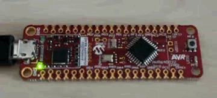
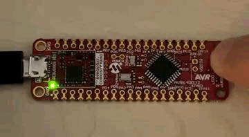

<!-- Please do not change this html logo with link -->

# Watchdog Timer (WDT) Example Using the AVR64DD32 Microcontroller Generated with MCC Melody

The repository contains one MPLAB® X project:
1.  [Watchdog Timer in Normal Mode](#1-watchdog-timer-in-normal-mode) – This code demonstrates the capabilities of the Watchdog Timer (WDT) peripheral. The application starts by blinking the on-board LED (PF5) three times to signify a reset.

## Related Documentation

More details and code examples on the AVR64DD32 can be found at the following links:

- [AVR64DD32 Product Page](https://www.microchip.com/wwwproducts/en/AVR64DD32)
- [AVR64DD32 Code Examples on GitHub](https://github.com/microchip-pic-avr-examples?q=AVR64DD32)
- [AVR64DD32 Project Examples in START](https://start.atmel.com/#examples/AVR64DD32CuriosityNano)

## Software Used

- [MPLAB® X IDE](http://www.microchip.com/mplab/mplab-x-ide) v6.00 or newer
- [MPLAB® XC8](http://www.microchip.com/mplab/compilers) v2.36 or newer
- [AVR-Dx Series Device Pack](https://packs.download.microchip.com/) v2.1.152 or newer
- [MPLAB® Code Configurator Melody](https://www.microchip.com/en-us/tools-resources/configure/mplab-code-configurator/melody) core 2.1.11 or newer

## Hardware Used

- The AVR64DD32 Curiosity Nano Development board is used as a test platform
   

## Operation

To program the Curiosity Nano board with this MPLAB® X project, follow the steps provided in the [How to Program the Curiosity Nano board](#how-to-program-the-curiosity-nano-board) chapter. 

## 1. Watchdog Timer in Normal Mode

This code demonstrates the capabilities of the Watchdog Timer (WDT) peripheral. The application starts by blinking in on-board LED (PF5) three times to signify a reset.
Then, it runs the My_Application code that checks if the button is pressed. If it is not, then it blinks the LED one more time and resets the Watchdog Timer.
These steps will be repeated in an infinite loop until the button is pressed for more than four seconds. When this happens, the WDT time-out period will reset the microcontroller.

### 1.1 Setup

The following configurations are required for this project:

- System clock: 4 MHz (default)
- Fuses set:
  - WDTCFG0 - enables WDT in Normal mode with a four-second period
  - SYSCFG0 - CRC off, Reset pin as GPIO
- Pin PF5 is configured as digital output (LED)
- Pin PF6 is configured as digital input (button) with enabled internal pull-up resistor

| Pin |     Configuration      |
| :-: | :--------------------: |
| PF5 |  Digital output (LED)  |
| PF6 | Digital input (button) |

### 1.2 Demo

After initialization, the program makes the LED blink three times and then checks the status of the on-board button (PF6).
It waits until it is released, then it blinks the LED one more time and clears the WDT flag.
The WDT is used in Normal Mode, and can be periodically reset within the four-second period.

- If the button is not pressed, the LED will blink one time per second, showing the code running in a loop
   
- If the button is pressed and held for more than four seconds, then the LED will blink three times, showing the WDT time-out has occured and the microcontroller was reset by the WDT
   

### 1.3 Summary

This code example shows how to configure the WDT period and demonstrates its use by reseting the microcontroller, if and when the code gets stuck for more than the desired period.  
[Back to top](#watchdog-timer-wdt-example-using-the-avr64dd32-microcontroller-generated-with-mcc-melody)

## How to Program the Curiosity Nano board

This chapter shows how to use the MPLAB® X IDE to program an AVR® device with an Example_Project.X. This can be applied to any other projects.

- Connect the board to the PC

- Open the Example_Project.X project in MPLAB® X IDE

- Set the Example_Project.X project as main project

  - Right click the project in the **Projects** tab and click **Set as Main Project**
     

- Clean and build the Example_Project.X project

  - Right click the **Example_Project.X** project and select **Clean and Build**
     

- Select **AVRxxxxx Curiosity Nano** in the Connected Hardware Tool section of the project settings:

  - Right click the project and click **Properties**
  - Click the arrow under the Connected Hardware Tool
  - Select **AVRxxxxx Curiosity Nano** (click the **SN**), click **Apply** and then click **OK**:
     

- Program the project to the board
  - Right click the project and click **Make and Program Device**
     

- - -
- [Back to 1. Watchdog Timer in Normal Mode](#1-watchdog-timer-in-normal-mode)
  - [Back to 1.1 Setup](#11-setup)
  - [Back to 1.2 Demo](#12-demo)
  - [Back to 1.3 Summary](#13-summary)
- [Back to top](#watchdog-timer-wdt-example-using-the-avr64dd32-microcontroller-generated-with-mcc-melody)
- - -
